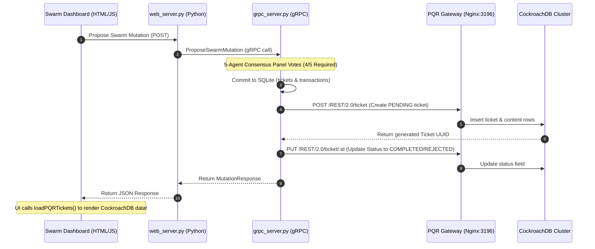

# 📊 Best Practical Request Tracker (RT) Schema Compliance

This document maps our swarm's memory databases directly to the data modeling guidelines of **Best Practical's Request Tracker (RT)**, the legendary enterprise issue-tracking engine.

---

## 🛠️ Data Modeling Principles

Best Practical's RT utilizes a highly scalable, event-driven auditing paradigm. Rather than storing flat status records, every operational action writes a permanent **Transaction** row referencing a parent **Ticket**. Our swarm implements this exact data structure to guarantee 100% auditable supervision trace mapping.

```
                      ┌──────────────────┐
                      │    RT::Ticket    │
                      └────────┬─────────┘
                               │ (1 to Many)
                               ▼
                    ┌─────────────────────┐
                    │   RT::Transaction   │
                    └──────────┬──────────┘
                               │ (Event Types)
         ┌─────────────────────┼─────────────────────┐
         ▼                     ▼                     ▼
    [ Type: Create ]     [ Type: Status ]      [ Type: Set ]
    * Seeding Logs       * State Changes       * Value Overrides
```

---

## 📐 Relational Database Schema Maps

The `agent_pedigree.db` SQLite catalog contains two fully RT-compliant tables:

### 1. The `tickets` Table
This table holds the operational tickets submitted by active agents or human supervisors.

| Column | SQL Type | Description | RT Compliance Mapping |
|--------|----------|-------------|-----------------------|
| `ticket_id` | `INTEGER` | Auto-incrementing primary key | Unique Ticket Identifier |
| `Queue` | `TEXT` | Work queue name (e.g. `Swarm-Mutations`, `Time-Machine`) | Queue Partitioning |
| `Subject` | `TEXT` | Summary of the proposed action | Ticket Subject Text |
| `Status` | `TEXT` | Lifecycle status (`new`, `resolved`, `rejected`) | Ticket Lifecycle Status |
| `Owner` | `TEXT` | Assigned worker agent (`Nobody` or specific agent) | Assigned Ticket Owner |
| `Creator` | `TEXT` | Proposing agent ID | Principal Creator |
| `Priority` | `INTEGER` | Task execution urgency index | Numerical Priority Model |
| `TimeEstimated` | `INTEGER` | Expected operational timeframe (minutes) | Duration Estimator |
| `TimeWorked` | `INTEGER` | Time already expended on task | Accumulator Metrics |
| `TimeLeft` | `INTEGER` | Remaining estimate to resolution | Active Delta Track |
| `Created` | `TEXT` | Timestamp of proposal creation | ISO Creation Date |
| `Resolved` | `TEXT` | Timestamp of commit/rejection resolution | ISO Resolution Date |
| `LastUpdated` | `TEXT` | Timestamp of most recent modification | ISO Update Track |
| `LastUpdatedBy`| `TEXT` | Agent performing the modification | Modifying Principal |

### 2. The `transactions` Table
Tracks every lifecycle event and state parameter override.

| Column | SQL Type | Description | RT Compliance Mapping |
|--------|----------|-------------|-----------------------|
| `transaction_id`| `INTEGER` | Unique Transaction sequence key | Transaction Identifier |
| `ObjectType` | `TEXT` | Target type reference (e.g., `RT::Ticket`) | Polymorphic Type Binding |
| `ObjectId` | `INTEGER` | Foreign key referencing `tickets.ticket_id` | Core Object Reference |
| `TimeTaken` | `INTEGER` | Work hours spent on this transaction | Activity Duration |
| `Type` | `TEXT` | Event classification (`Create`, `Status`, `Set`, `Timeline-Fork`) | Transaction Event Type |
| `Field` | `TEXT` | Modified parameter key (e.g., `model_temperature`) | target Parameter Field |
| `OldValue` | `TEXT` | Pre-mutation parameter value | Historical State |
| `NewValue` | `TEXT` | Post-mutation parameter value | Advanced State |
| `Data` | `TEXT` | Narrative description of the event | Detailed Transaction log |
| `Creator` | `TEXT` | Executing agent ID | Acting Principal |
| `Created` | `TEXT` | Timestamp of transaction logging | ISO Timestamp |

---

## ⚖️ Federated PQR CockroachDB Schema Integration

To expand standard RT compliance to physical-legal boundaries (such as the Marshall Islands DAO LLC framework), Sovereign System v2.0 integrates the **PQR Federated Digital Registry** built on Go and CockroachDB (v23.1.13).

Every gRPC consensus proposal approved on the local control plane is automatically synchronized as a global, auditable DAO Ticket in CockroachDB through the REST 2.0 Bridge Gateway (port `3196`).

### 1. CockroachDB `tickets` Table
Stores high-performance global registry tickets across the multi-master cloud cluster.

| Column | SQL Type | Description | PQR Domain Mapping |
|--------|----------|-------------|--------------------|
| `id` | `UUID` | Primary key identifier | Global Ticket ID |
| `status` | `VARCHAR` | Current ticket state (`PENDING`, `COMPLETED`, `REJECTED`) | Registry State |
| `layer` | `INTEGER` | Security architectural layer (e.g., `3`) | Security Boundary Layer |
| `creator` | `VARCHAR` | Identity of the proposing agent | Registry Principal |
| `assigned_to`| `VARCHAR` | Assigned peer node or specialist agent | Task Allocator |
| `created_at`| `TIMESTAMPTZ` | Timestamp of ticket insertion | Global Registry Time |

### 2. CockroachDB `ticket_content` Table
Stores deep diagnostic JSON metadata and payloads.

| Column | SQL Type | Description | PQR Domain Mapping |
|--------|----------|-------------|--------------------|
| `ticket_id` | `UUID` | Foreign key referencing `tickets.id` | Content Owner ID |
| `intent_blob` | `JSONB` | Smart metadata (e.g. proposed keys, vote structures, veto counts) | JSON Payload Envelope |
| `raw_content` | `BYTEA` | Full raw text and diagnostic details | Complete Diagnostic Log |

### 3. CockroachDB `ticket_relationships` Table
Maps directed graph lineages between tickets (e.g., `RelEvolution` linking to Genesis `00000000-0000-0000-0000-000000000000`).

| Column | SQL Type | Description | Relationship Mapping |
|--------|----------|-------------|----------------------|
| `source_id` | `UUID` | Parent ticket reference | Directed Origin |
| `target_id` | `UUID` | Child ticket reference | Directed Destination |
| `relation_type`| `VARCHAR` | Relation type classification (`RelEvolution`) | Lineage Mapping |
| `creator` | `VARCHAR` | Mapping creator ID | Principal Modeler |
| `created_at`| `TIMESTAMPTZ` | Relation mapping timestamp | Time of Association |

### 🔄 Dynamic Settling Sequence Diagram

